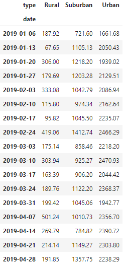

# Pyber Analysis with Matplotlib

## Overview of Project
V. Isualize, a co-founder of PyBer, has tasked Omar and I with summarizing ride-sharing data by city type. Utilizing Pandas and Matplotlib, we also created a multiple-line graph that showcases the total weekly fares for each type of city.

In our ride-sharing summary, we determined the total number of rides, drivers, and sum of fares for each city type. We also calculated the average fare per ride and fare per driver in each type of city.
 
 
## Results

According to our analysis, we can clearly determine that Urban city types have far more total rides and fares, resulting in a higher total fare amount. We can infer this is because of the density of people in Urban environments versus Rural or Suburban. With no surprise, Suburban city types fall second and Rural ones have shown to have the least amount of total drivers, rides, and fares.

Average fare prices per ride are most expensive in Rural city types compared to Suburban and Urban, which is the least expensive. We can also infer that with Urban environments being increasingly more dense, ride-sharing is more popular and more frequent, resulting in increased demand and lower prices.

Total rides in Rural and Suburban cities exceed the amount of total drivers, where in Urban cities, drivers exceed the amount of total rides by almost 70%

Our calculations are accurate throughout the year when breaking down the sum of all fares by city type. Each week, Rural cities have the lowest value while Urban is consistently the highest.

Total fares typically increase between Feburary and March for all city types, and slowly decrease for Rural and Urban types after April. 
 
 
## Summary and Proposals

To summarize, the number of rides and drivers in much larger in Urban city types compared to Rural and Suburban types. However, the average fare per ride is much less in Urban environments compared to Suburban and Rural. The average fare per driver in Rural environments is more than 3x the price in Urban cities.

From our analysis, we curated 3 business recommendations for the CEO:
1. The company should look into allocating more drivers to rural and suburban areas, as ride-sharing capabilities seem to be lacking and prices are much higher.
2. With over 2,000 drivers in Urban cities and only around 1,600 rides, allocating more drivers to Suburban and Rural areas would be ideal as these city types have more rides than drivers.
3. We may want to gather more recent data from 2021 or preferably from 2022 as ride-sharing has become increasingly more common and popular among all city types.